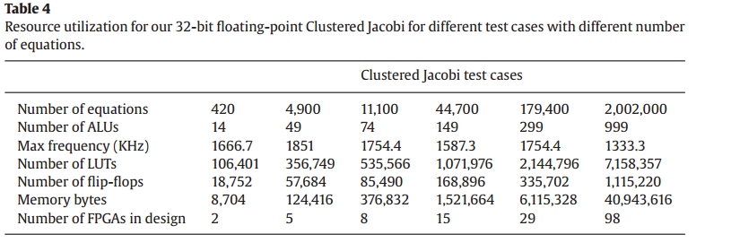

# Initial report and Q/A
The steps i have noticed so far in order to implement a hardware based accelerator based on the linear-solver paper
+ Start with the software implementation
+ Figure out the bottlenecks 
+ Make use of the hardware to do these operations in parallel as much as possible
+ Rearrange memory and avoid doing unnecessary operations if possible
    + *As in the case with the sparse-gauss implementation exploiting the FEM  generated matrix properties*
+ Make sure to group independent tasks **clusters** and run them in parallel 
    + *As in the case with clustered gauss and clustered jacobi* where independent inputs are grouped together in memory, and are all executed in parallel on *multiple ALUs at the same time*
+ Optimize for throughput when possible 
    + As in the case of the pipelined jacobi solution
    + Make sure to consider dependencies between the pipeline stages **Hazards**

### Questions
+ Does the number of hardware modules Ex. ALUs is assigned before synthesis; based on the problem size as in **Table 4** ?

+ How do we build these independent clusters? Does the software figure this out before copying the data into the hardware? Do we set the number of the clusters before synthesis ?

### Current status
+ At the moment i am still looking for team members

### Next steps
+ Get familiar with non liner equations traditional solving methods
+ Get introduced to the concept of `genetic algorithms` and `neural networks`

### Figures 

**Table 4**

 

